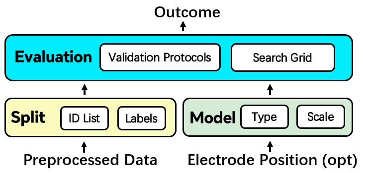
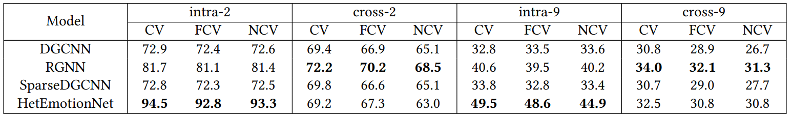

---
<!-- Electroencephalography (EEG) classification is a crucial task in neuroscience, neural engineering, and several commercial applications. Traditional EEG classification models, however, have often overlooked or inadequately leveraged the brain’s topological information. Recognizing this shortfall, there has been a burgeoning interest in recent years in harnessing the potential of Graph Neural Networks (GNN) to exploit the topological information by modeling features selected from each EEG channel in a graph structure. 

However, it remains challenging to evaluate the transferability of these models and implement GNN-based EEG classification models in practice due to the lack of easy-to-use toolkits and large-scale public benchmarks. To tackle this, we build GNN4EEG, a benchmark and toolkit for EEG classification with GNN. -->

GNN4EEG is a benchmark and toolkit focusing on Electroencephalography (EEG) classification tasks via Graph Neural Network (GNN), aiming to facilitate research in this direction. Researchers can arbitrarily choose their prefered GNN models, hyper-parameters and experimental protocols. Training and evaluating dataset can be flexibly chosen as the default FACED dataset (with detailed information listed in "Models and Dataset" chapter) or any self-built datasets.  The characteristics of our toolkit can be summarized as follows:

- **Large Benchmark**: We introduce a large
benchmark constructed with ***4*** EEG classification tasks based on
EEG data collected from the FACED dataset , consists of ***123*** subjects . 

- **Multiple SOTA Models**:  We implement  ***4*** state-of-the-art GNN-based EEG classification
models, i.e., DGCNN, RGNN, SparseDGCNN and HetEmotionNet.

- **Various Experimental Protocols**:  We provide comprehensive experimental settings and evaluation protocols, e.g., ***2*** data splitting protocols, and ***3*** cross-validation protocols.

- **Easy for Usage**: Our toolkit can proceed the whole process of training and tuning an available EEG classification model for real-time applications ***in just a few lines of code***. 

- **Flexible Framework**: Researchers can arbitrarily select their experimental settings and datasets.

<!-- Generally, GNN4EEG implements **4 EEG classification tasks** as the benchmark, **3 validation protocols** , and **4 GNN models** . -->

## Structure

Generally, GNN4EEG decomposes the whole training and evaluating progress into three steps:

- **Data Splitting**: First, it is necessary to choose the data splitting protocols, i.e., intra-subject or cross-subject. A list describing
the subject of each sample should be provided to guide the splitting.

- **Model Selection**: To initiate a specific model, parameters like
the number of classification categories, graph nodes, hidden layer dimension, and GNN layers should be included. Electrode positions, frequency values, and other options are also necessities for certain
GNN models.

- **Validation Protocols and Other Training Configurations**: The
final step is to declare the validation protocols and other configurations. As illustrated above, GNN4EEG provides three validation protocols, i.e., CV, FCV, and NCV. For detailed training configurations, the user can set the learning rate, dropout rate, number of
epochs, 𝐿1 and 𝐿2 regularization coefficient, batch size, optimizer,
and training device.

A data flow diagram is illustrated as following:

## Getting Started

## Example Usage
data_split
data_FACED
model
evaluation
model.train
model.predict
## Aruguments 

## Models and Dataset

**Models:**

**Dataset:**

**Experiments:**

We present the experimental setup and the evaluation results using the proposed GNN4EEG toolkit on FACED dataset. Analyses of
overall performances are elaborated here. The experiments are implemented on NVIDIA GeForce RTX 3090.

(Here, "intra-2" means binary intra-subject classification task and "cross-9" means 9 class cross-subject classification task. Others are similar.)

In the experiments, we set the fold number 𝐾 = 10 for all validation protocols and the
“inner” fold number 𝐾
′ = 3 for NCV. In intra-subject tasks, the 30
seconds EEG signals among all video clips and subjects are equally
split into 𝐾 folds. While in cross-subject tasks, the 123 subjects are
split into 𝐾 folds, with the last fold containing 15 subjects and the
former each containing 12 subjects.
We tune the number of hidden dimensions from {20, 40, 80} and
the learning rate from {0.0001, 0.001, 0.01} for all tasks and models.
Moreover, the dropout rate is 0.5, the number of GNN layers is 2,
the batch size is 256, and the maximum number of epochs is set
as 100. To address potential overfitting in different settings, we
have utilized different weights for the 𝐿1 and 𝐿2 norm in different
tasks. Specifically, both weights are set as 0.001 for intra-2, 0.005
for cross-9, and 0.003 for cross-2 and intra-9. 

## Citations

TO BE DONE

## Contact

Kaiyuan Zhang (<kaiyuanzhang2001@gmail.com>)

Ziyi Ye (<yeziyi1998@gmail.com>)
